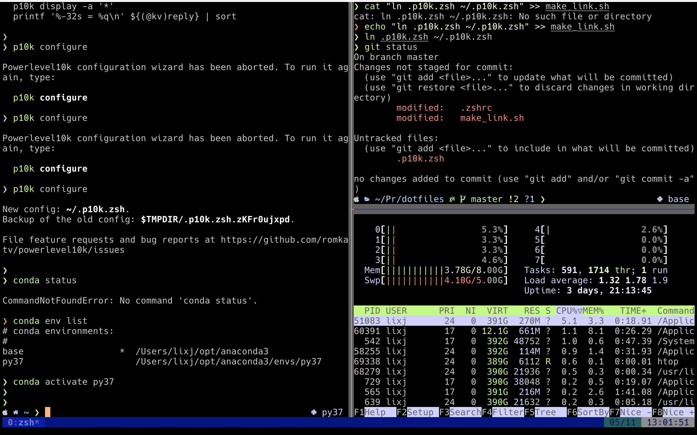

# 我的配置文件

## 使用方式

```bash
sh make_link.sh
```

## 使用效果



## Tmux

参考链接：[https://www.hamvocke.com/blog/a-guide-to-customizing-your-tmux-conf/]

## Vim

基于这个配置：[https://github.com/amix/vimrc]

增加自己的配置，编辑这个文件：`~/.vim_runtime/my_configs.vim`

## Zsh

使用主题 `powerlevel10k`：[https://gitee.com/kongren/powerlevel10k]

主题配置文件：[.p10k.zsh](./.p10k.zsh)

